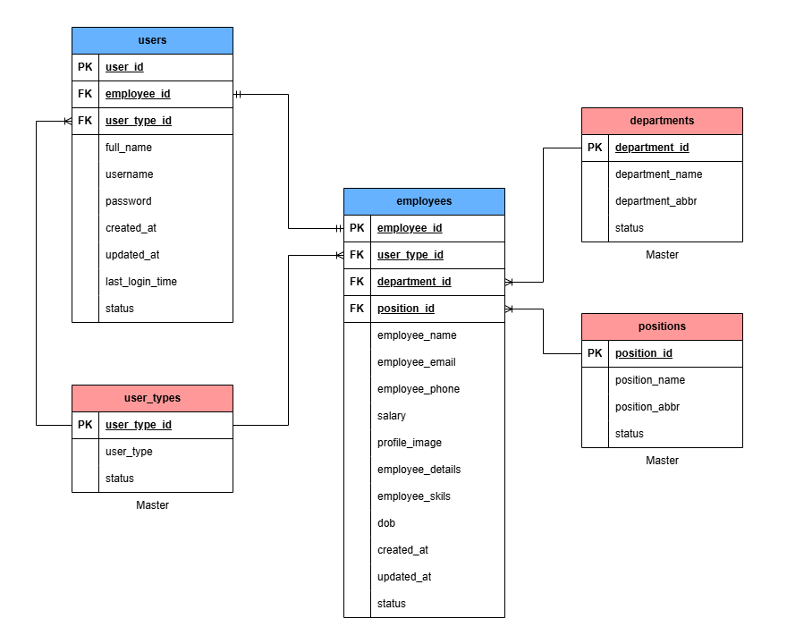

# Custom PHP Assignment - Basic Employee Management System

## Objective
To develop a simple **Employee Management System** using **PHP and PostgreSQL** with CRUD functionality. The application should also include **user registration and login functionality** etc.

## Features

### 1. User Registration and Login
- Registration page for new users.
- Login page to authenticate users.
- Password hashing for security (**password_hash** and **password_verify**).

### 2. CRUD Operations for Admin
- Add a new employee.
- View a list of employees.
- Edit employee details.
- Delete an employee.

### 3. Other Users
- View own profile.
- Edit own profile.
- Change password.

### 4. Frontend Requirements
- Use **HTML, CSS, and Bootstrap** for a responsive design.
- Use **jQuery** for basic interactivity (e.g., confirmation before deletion).

## Database Schema


## Project Structure
```
your_project_folder/
├── css/
│       ├── styles.css
│       ├── other CSS files
├── js/
│       ├── script.js
│       ├── other JS files
├── templates/
│       ├── header.php
│       ├── footer.php
├── uploads/
│       ├── profile1.jpg
│       ├── profile2.jpg
├── images/
│       ├── img1.jpg
│       ├── img2.jpg
├── include/
│       ├── config.php
├── register.php
├── login.php
├── dashboard.php
├── profile.php
├── password_change.php
├── add_employee.php
├── edit_employee.php
├── delete_employee.php
├── logout.php

```
*Note: You can add more files if needed.*

## Implementation Guidelines

### 1. Bootstrap Integration
- Use Bootstrap for styling forms, tables, buttons, and navigation.

### 2. Database Connection (`config.php`)
- Database connection string.
- Other config variables and functions.

### 3. Form Validation
- Validate input fields using PHP and display error messages.
- Use jQuery for frontend validation.

### 4. Password Hashing
- Use `password_hash()` for storing passwords during registration.
- Use `password_verify()` for checking passwords during login.

### 5. Session Management
- Start a session after a successful login and restrict access to logged-in users only.

### 6. Security
- Follow best practices for handling user inputs securely.
- Implement additional protective measures for forms (optional for advanced trainees).

### 7. Testing
- Ensure all CRUD operations and login/logout functionality work as expected.

## How to Set Up the Project
1. Clone the repository:
   ```sh
   git clone https://github.com/hedparag/project_1_main.git
   ```
2. Configure the database in `include/config.php`.
3. Run the project on a local server (XAMPP/LAMP/MAMP/WAMP).
4. Open `register.php` to create an account.
5. Login and start using the system.

## License
This project is for educational purposes only. Feel free to modify and improve it!

